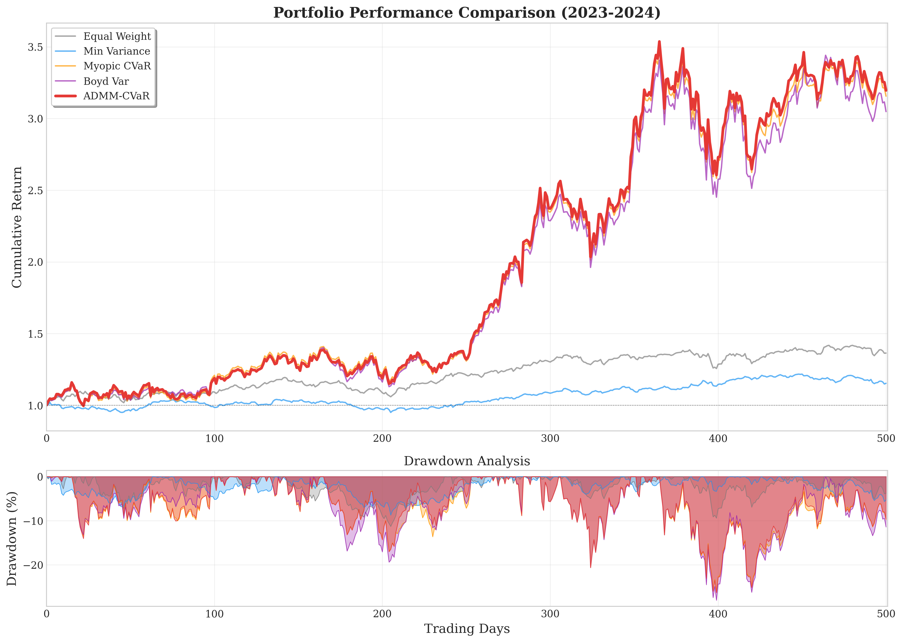
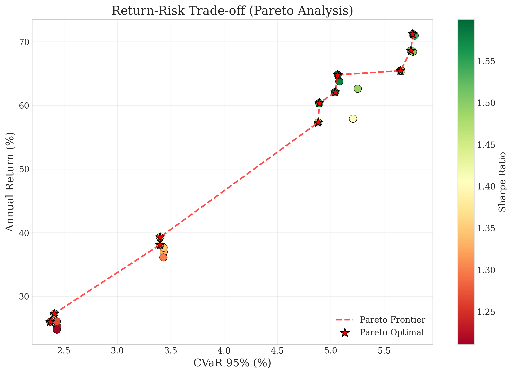
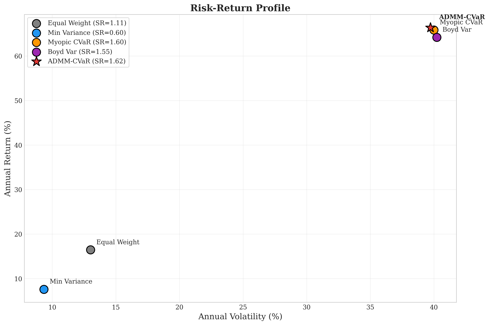
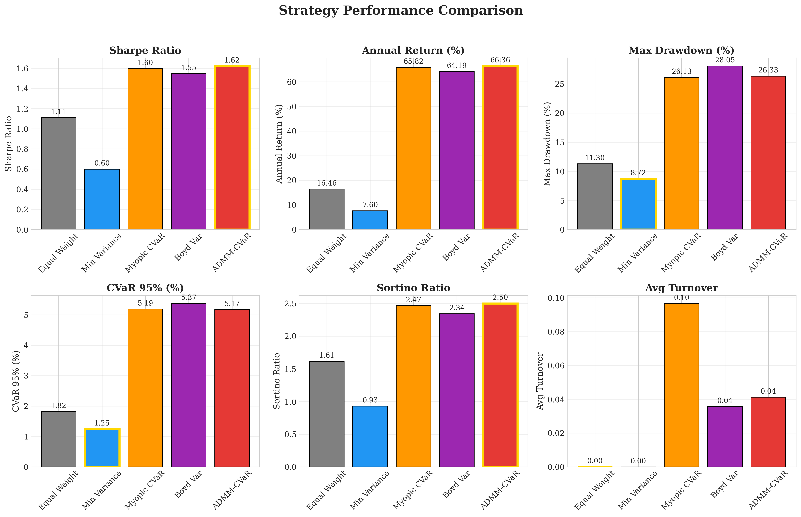

# Multi-Period Portfolio Optimization with CVaR Constraints via ADMM

[](https://www.python.org/downloads/)
[](https://opensource.org/licenses/MIT)
[](https://www.cvxpy.org/)

A unified framework for multi-period portfolio optimization combining **Conditional Value-at-Risk (CVaR)** constraints with **ADMM-based decomposition** for efficient computation.

## Overview

This project addresses a critical gap in portfolio optimization by formulating a multi-period framework that simultaneously incorporates:
- **CVaR constraints** for coherent tail-risk management
- **Transaction costs** for realistic trading frictions
- **ADMM decomposition** for scalable computation

<p align="center">
  
</p>

## Key Results

Our ADMM-CVaR method achieves **superior risk-adjusted returns** compared to baseline strategies:

| Strategy | Annual Return | Sharpe Ratio | CVaR (95%) | Max Drawdown |
|----------|--------------|--------------|------------|--------------|
| Equal Weight | 16.46% | 1.11 | 1.82% | 11.30% |
| Min Variance | 7.60% | 0.60 | 1.25% | 8.72% |
| Myopic CVaR | 65.82% | 1.60 | 5.19% | 26.13% |
| Boyd Variance | 64.19% | 1.55 | 5.37% | 28.05% |
| **ADMM-CVaR (Ours)** | **66.36%** | **1.62** | **5.17%** | 26.33% |

## Mathematical Formulation

### Problem Statement

We solve the following multi-period CVaR-constrained portfolio optimization:

```math
\begin{aligned}
\max_{w_1, \ldots, w_T} \quad & \sum_{t=1}^{T} \left( \mu_t^\top w_t - \frac{\lambda_{tc}}{2} \|w_t - w_{t-1}\|_2^2 \right) \\
\text{s.t.} \quad & \mathbf{1}^\top w_t = 1, \quad \forall t \\
& w_t \geq 0, \quad \forall t \\
& \text{CVaR}_\alpha(w_t) \leq \beta, \quad \forall t
\end{aligned}
```

where:
- `w_t`: portfolio weights at time t
- `μ_t`: expected return vector
- `λ_tc`: transaction cost penalty
- `β`: CVaR risk budget
- `α`: CVaR confidence level (default: 95%)

### CVaR Reformulation

For scenarios `{r_t^(s)}`, CVaR is reformulated as a linear program:

```math
\text{CVaR}_\alpha(w_t) = \min_{\nu, u} \left\{ \nu + \frac{1}{(1-\alpha)S} \sum_{s=1}^{S} u_s \right\}
```

subject to `u_s ≥ -w_t^T r_t^(s) - ν` and `u_s ≥ 0`.

### ADMM Decomposition

We decompose the problem using consensus variables:

**w-update (parallel):**
```
w_t^{k+1} = (μ_t + y_t^k + ρz_t^k + λ_tc w_{t-1}^{k+1}) / (λ_tc + ρ)
```

**z-update (projection onto constraint set):**
```
z_t^{k+1} = Π_{C_t}(w_t^{k+1} + y_t^k/ρ)
```

**Dual update:**
```
y_t^{k+1} = y_t^k + ρ(w_t^{k+1} - z_t^{k+1})
```

## Sensitivity Analysis

<p align="center">
  
</p>

Optimal parameters identified through grid search:
- **Risk budget**: β = 0.05
- **Transaction cost penalty**: λ_tc = 0.005

<p align="center">
  
</p>

## Project Structure

```
├── src/
│   ├── models/
│   │   ├── admm.py          # ADMM-CVaR optimizer
│   │   ├── cvar.py          # CVaR computation
│   │   └── baselines.py     # Baseline strategies
│   ├── optimization/
│   │   ├── multi_period.py  # Multi-period framework
│   │   └── single_period.py # Single-period solvers
│   ├── backtesting/
│   │   ├── backtest.py      # Backtesting engine
│   │   └── metrics.py       # Performance metrics
│   ├── data/
│   │   ├── loader.py        # Data loading utilities
│   │   └── preprocessor.py  # Data preprocessing
│   └── visualization/
│       └── plots.py         # Plotting functions
├── experiments/
│   ├── run_final_analysis.py    # Sensitivity analysis
│   └── run_optimal_analysis.py  # Strategy comparison
├── results/
│   ├── figures/             # Generated figures
│   └── tables/              # Result tables
└── paper/
    └── main.tex             # LaTeX paper
```

## Installation

```bash
# Clone the repository
git clone https://github.com/ZhaoYiping789/Multi-Period-Portfolio-Optimization-with-CVaR-Constraints-via-ADMM-A-Unified-Framework.git
cd Multi-Period-Portfolio-Optimization-with-CVaR-Constraints-via-ADMM-A-Unified-Framework

# Create virtual environment
python -m venv .venv
source .venv/bin/activate  # On Windows: .venv\Scripts\activate

# Install dependencies
pip install -r requirements.txt
```

## Usage

### Quick Start

```python
from src.models.admm import ADMMCVaROptimizer

# Initialize optimizer
optimizer = ADMMCVaROptimizer(
    beta=0.05,           # CVaR risk budget
    lambda_tc=0.005,     # Transaction cost penalty
    alpha=0.95,          # CVaR confidence level
    rho=1.0              # ADMM penalty parameter
)

# Run optimization
result = optimizer.optimize(
    mu=expected_returns,      # Shape: (T, n)
    scenarios=return_scenarios,  # Shape: (T, S, n)
    w0=initial_weights        # Shape: (n,)
)

weights = result['weights']  # Optimal portfolio weights
```

### Run Experiments

```bash
# Run sensitivity analysis
python experiments/run_final_analysis.py

# Run strategy comparison with optimal parameters
python experiments/run_optimal_analysis.py
```

## Additional Results

### Risk-Return Tradeoff

<p align="center">
  
</p>

### Strategy Comparison

<p align="center">
  
</p>

### Portfolio Weight Evolution

<p align="center">
  
</p>

## Requirements

- Python >= 3.8
- cvxpy >= 1.4.0
- numpy >= 1.21.0
- pandas >= 1.3.0
- scipy >= 1.7.0
- matplotlib >= 3.4.0
- seaborn >= 0.11.0
- yfinance >= 0.2.0
- tqdm >= 4.62.0

## Citation

If you use this code in your research, please cite:

```bibtex
@misc{zhao2025multiperiod,
  title={Multi-Period Portfolio Optimization with CVaR Constraints via ADMM: A Unified Framework},
  author={Zhao, Yiping},
  year={2025},
  howpublished={ELEC5470 Final Project, HKUST}
}
```

## References

1. Markowitz, H. (1952). Portfolio selection. *Journal of Finance*, 7(1), 77-91.
2. Rockafellar, R. T., & Uryasev, S. (2000). Optimization of conditional value-at-risk. *Journal of Risk*, 2, 21-42.
3. Boyd, S., et al. (2017). Multi-period trading via convex optimization. *Foundations and Trends in Optimization*, 3(1), 1-76.
4. Boyd, S., et al. (2011). Distributed optimization and statistical learning via the alternating direction method of multipliers. *Foundations and Trends in Machine Learning*, 3(1), 1-122.

## License

This project is licensed under the MIT License - see the [LICENSE](LICENSE) file for details.

## Acknowledgments

This project was developed as part of the ELEC5470 Convex Optimization course at the Hong Kong University of Science and Technology.
